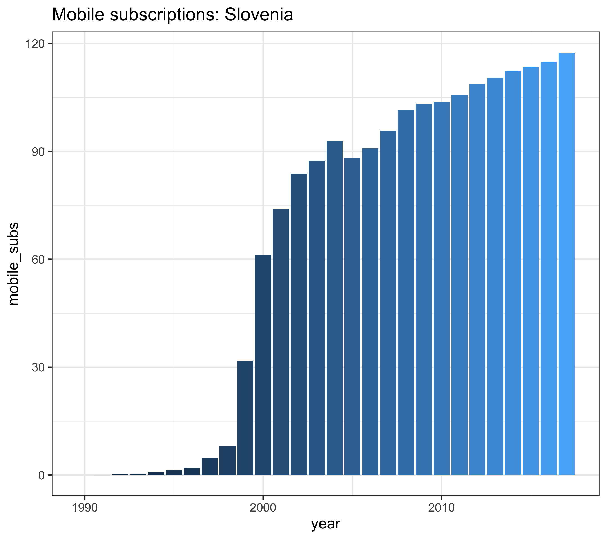
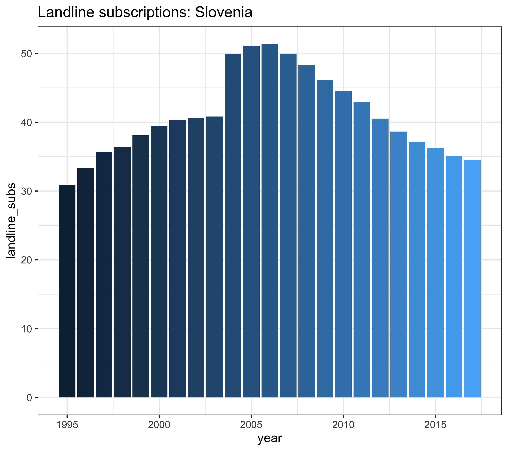
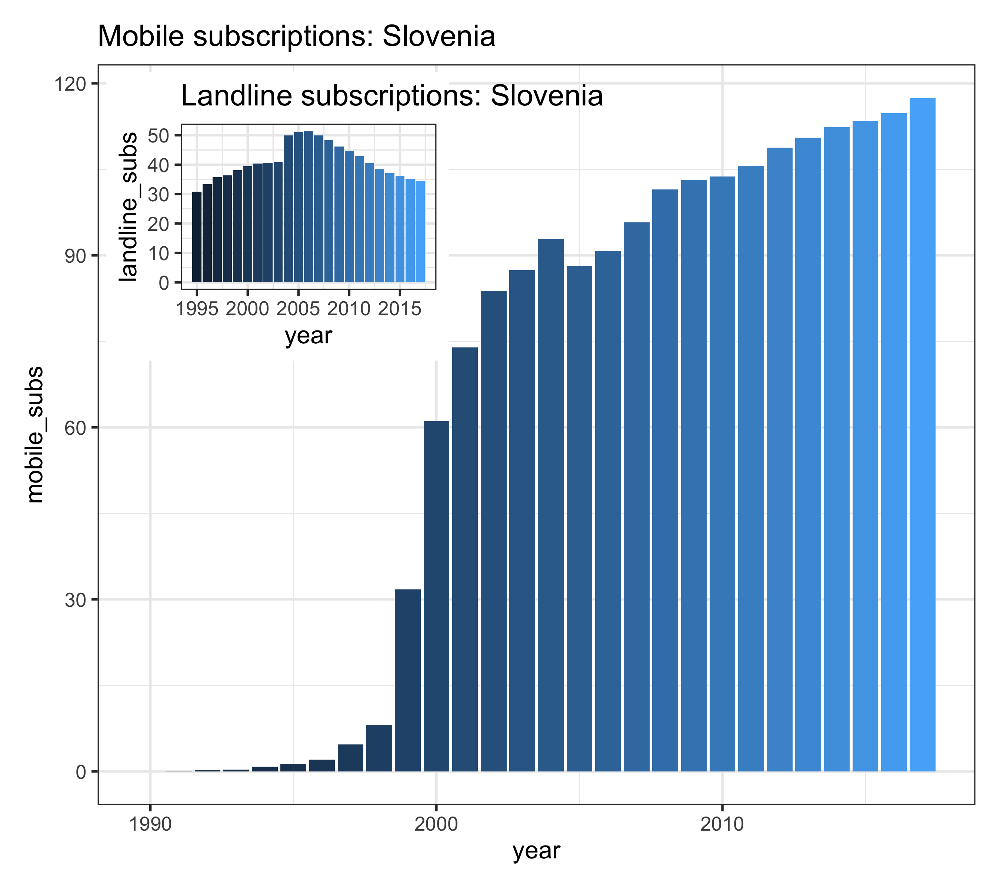

# Basic demonstration of Patchwork
#### Author: Jernej Baranja
#### Version: 1.0
#### Date: 5/2/2021
#### Output: html_document

```{r setup, include=FALSE}
knitr::opts_chunk$set(echo = TRUE)
```

## Mobile and landline subscriptions in Slovenia

In this document we will present growth and decline of mobile and landline subscriptions in Slovenia using Patchwork. 

##### load packages 
```{r message=FALSE, warning=FALSE}
library(tidyverse)
library(patchwork)
theme_set(theme_bw(16))
```

##### read in the data 
```{r message=FALSE, warning=FALSE}
mobile <- readr::read_csv('https://raw.githubusercontent.com/rfordatascience/tidytuesday/master/data/2020/2020-11-10/mobile.csv')
landline <- readr::read_csv('https://raw.githubusercontent.com/rfordatascience/tidytuesday/master/data/2020/2020-11-10/landline.csv')
```

# Lets make some plots

##### Slovenia mobile data
```{r, fig.show='hide'}
p1 <- mobile %>%
  filter(entity=="Slovenia") %>%
  ggplot(aes(x=year, y=mobile_subs, fill = year)) + 
  geom_col(show.legend = FALSE)+
  labs(title="Mobile subscriptions: Slovenia")

print(p1)
```



##### Slovenia landline data
```{r, fig.show='hide'}
p2 <- landline %>%
  na.omit() %>% 
  filter(entity=="Slovenia") %>%
  ggplot(aes(x=year, y=landline_subs, fill = year)) + 
  geom_col(show.legend = FALSE)+
  labs(title="Landline subscriptions: Slovenia")

print(p2)
```




# Now lets put these 2 plots together

##### inset element (Patchwork)
```{r, fig.show='hide'}
p1 + inset_element(p2, right = 0.40,
                   bottom = 0.60, 
                   left = 0.01,
                   top = 0.99) 
```



## Conclusion

As shown in the graph, mobile telephony is on the rise and landline telephony is on the decline, which is to be expected.
